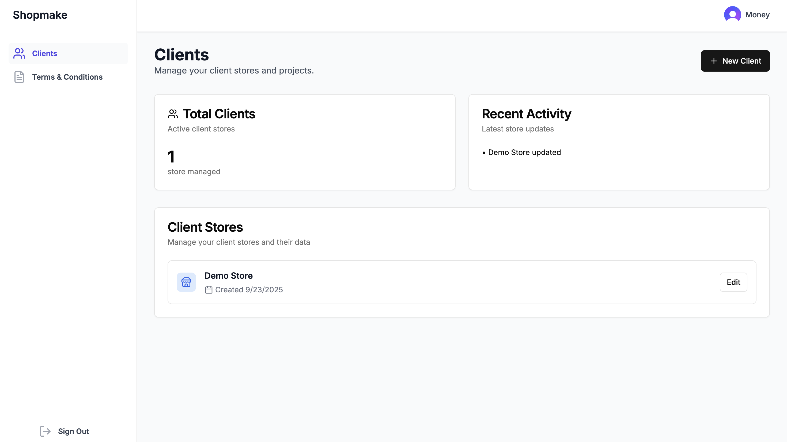

# Shopmake



**Live Deployment:** [https://www.shopmake.app/](https://www.shopmake.app/)

**AI-powered Shopify store generator** — A full-stack SaaS that lets agencies generate and deploy fully built, SEO-ready Shopify stores from brand data and CSVs. One workflow: add a client, configure store data, connect Shopify, then generate theme, products, collections, policies, and inventory in one go.

---

## Contributors

James Jiang

---

## Overview

Shopmake is an internal agency tool that automates the heavy lifting of launching a Shopify store. Instead of manually building themes and importing data, operators use a single dashboard to manage multiple clients, upload product/customer CSVs, define branding and policies, and trigger a full store generation via the Shopify Admin API. The app uses a prebuilt **Genesis** theme (section-based JSON presets), optional **OpenAI**-driven collection suggestions, and a modular generation pipeline (foundation → products → variants → inventory → collections → policies → theme composition).

**Built as a showcase of:** full-stack TypeScript, Next.js App Router, REST API design, third-party API integration (Shopify, Supabase, Clerk), multi-tenant data modeling, and AI-assisted content generation.

---

## Tech Stack

| Layer        | Technology |
|-------------|------------|
| **Frontend** | Next.js 14 (App Router), React 18, TypeScript |
| **UI**      | Tailwind CSS, Radix UI (shadcn-style components), Lucide icons, `@hello-pangea/dnd` for drag-and-drop |
| **Auth**    | Clerk (protected routes, user-scoped data) |
| **Database** | Supabase (PostgreSQL + Storage) |
| **APIs**    | Shopify Admin API (2025-07), OpenAI API (structured outputs for collections) |
| **Deploy**  | Vercel |

---

## Features

- **Multi-tenant client dashboard** — Create and manage multiple stores; all data scoped by Clerk `userId`.
- **Store configuration** — Brand name, colors, fonts, contact email, logo; legal (policies, trading name, address); shipping (processing days, options); locations.
- **File uploads** — Product, customer, and inventory CSVs stored in Supabase Storage; used for import and AI context.
- **Shopify connection** — Custom app Admin API token per store; connection test and permission checks before generation.
- **Modular store generation** — Stepwise pipeline: foundation (theme upload + publish, locations, logo, contact) → visuals (theme settings) → products (CSV import, images, taxonomy) → variants & publish → inventory → collections (with optional smart rules) → customers → policies → theme composition (section presets per page).
- **Genesis theme system** — Section presets (e.g. `featured-collection`, `slideshow-hero`, `main-product`) as JSON; configurable **store layout** per page (home, product, collection, blog, etc.) with drag-and-drop section ordering.
- **AI-assisted collections** — Optional “magic” generation of smart collections from product CSV + store description using OpenAI (e.g. `gpt-4.1-mini`) with structured output (title, description, mapping rules).
- **REST API** — Coherent API surface for stores, store data, uploads, locations, shipping options, collections, mappings, and Shopify generate/connect/disconnect actions; auth and ownership enforced on each route.

---

## Project Structure

```
├── app/
│   ├── api/
│   │   ├── stores/                    # CRUD + locations, shipping, collections, uploads
│   │   │   └── [storeId]/collections/magic-generate/   # OpenAI collections
│   │   ├── shopify/
│   │   │   ├── connect/               # Save Shopify custom app token
│   │   │   ├── disconnect/
│   │   │   └── generate/             # Main generate + foundation, products, variants, etc.
│   │   └── uploads/                  # File upload to Supabase Storage
│   ├── dashboard/
│   │   ├── clients/                  # List clients, new client, edit client (full form)
│   │   ├── settings/
│   │   └── terms/
│   ├── sign-in/ sign-up/
│   ├── layout.tsx, page.tsx, globals.css
│   └── middleware.ts                 # Clerk auth
├── components/
│   ├── layout/                       # Dashboard layout
│   └── ui/                           # Card, Button, Input, StoreLayoutEditor (drag-and-drop), etc.
├── lib/
│   ├── api.ts                        # Frontend API helpers (stores, uploads, generate, Shopify connect)
│   ├── shopify.ts                    # ShopifyClient class + theme/section/product/collection/policy helpers
│   ├── supabase.ts                   # DB and storage access
│   ├── supabase-client.ts
│   ├── constants.ts
│   ├── policy-templates.ts
│   ├── section-presets/              # Genesis theme section JSON and loader
│   │   ├── genesis/                  # featured-collection, slideshow-hero, main-product, etc.
│   │   └── index.ts
│   └── utils.ts
├── types/
│   └── index.ts                      # Store, StoreData, StoreLayout, collections, mappings, API types
└── middleware.ts
```

---

## Getting Started

### Prerequisites

- Node.js 18+
- Accounts: [Clerk](https://clerk.com), [Supabase](https://supabase.com), [Shopify Partners](https://partners.shopify.com) (custom app with Admin API)
- Optional: [OpenAI](https://platform.openai.com) API key for “magic” collection generation

### Install and run

```bash
git clone <your-repo-url>
cd <project-directory>
npm install
cp .env.example .env.local   # if present; otherwise create .env.local
npm run dev
```

Open [http://localhost:3000](http://localhost:3000). Sign in (Clerk); the app redirects to the dashboard (e.g. `/dashboard/clients`).

### Environment variables

Configure in `.env.local`:

| Variable | Description |
|----------|-------------|
| `NEXT_PUBLIC_CLERK_PUBLISHABLE_KEY` | Clerk publishable key |
| `CLERK_SECRET_KEY` | Clerk secret key |
| `NEXT_PUBLIC_SUPABASE_URL` | Supabase project URL |
| `NEXT_PUBLIC_SUPABASE_ANON_KEY` | Supabase anon key |
| `OPENAI_API_KEY` | Optional; for magic collection generation |
| `NEXT_PUBLIC_APP_URL` | App URL (e.g. `http://localhost:3000`) for API base URL |

See `SUPABASE_SETUP.md` and `SHOPIFY_SETUP.md` for database schema, storage buckets, and Shopify custom app + Genesis theme setup.

---

## How store generation works

1. **Configure store** — User fills store form (brand, description, category, contact, logo, colors/fonts, policies, locations, shipping).
2. **Upload data** — Product (and optionally customer, inventory) CSVs are uploaded to Supabase and linked to the store.
3. **Connect Shopify** — User adds their Shopify store domain and custom app Admin API token; app verifies connection and permissions.
4. **Generate** — User triggers “Generate store.” The backend:
   - **Foundation:** Uploads Genesis theme ZIP from Supabase Storage, publishes it, creates locations, uploads logo, sets contact email.
   - **Visuals:** Updates active theme `settings_data.json` with store colors and fonts.
   - **Products:** Imports from product CSV, attaches images from uploads, enriches taxonomy.
   - **Variants & publish:** Adds variants (e.g. price, compare-at) and publishes products to the Online Store channel.
   - **Inventory:** Processes inventory CSV and updates inventory levels at the right locations.
   - **Collections:** Creates collections (and rules) from the app’s collection config; optionally uses “magic generate” (OpenAI) to suggest collections from product data.
   - **Customers:** Imports from customer CSV if provided.
   - **Policies:** Writes return, privacy, terms, shipping policies to the shop.
   - **Composition:** Builds theme template files from section presets and the store’s layout config (which sections appear on which page and in what order).

Result: a live, themed Shopify store with products, collections, and policies, ready for further tweaks in the Shopify admin.

---

## Authentication and data scope

- **Clerk** handles sign-in/sign-up; `middleware.ts` protects `/dashboard` and API routes that require a user.
- All store and store-related resources are tied to `created_by` (Clerk user ID). API routes validate ownership before returning or mutating data.

---

## License

Private / unlicensed unless otherwise specified.
